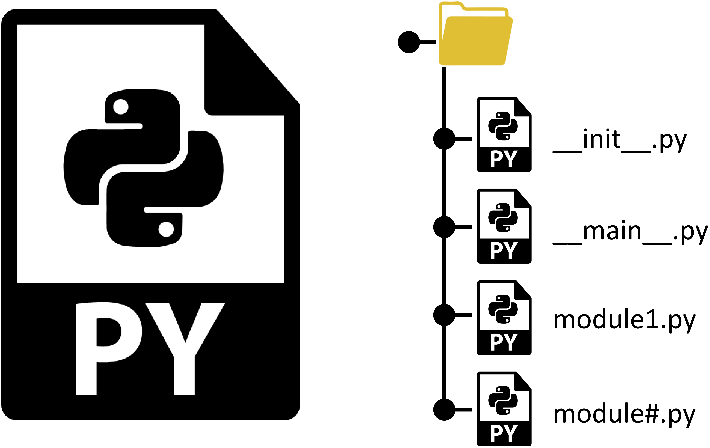

# ipyrun

[](https://mybinder.org/v2/gh/maxfordham/ipyrun/HEAD)
[](https://github.com/psf/black)


ipyrun is UI first package built on ipywidgets designed for rapidly creating an app user interface for use in a
jupyter notebook / lab or voila app. To run a script or process and generate resultant output files.
The app caches input, output and runtime data, such that the previous state of the app is available to the user when returning.

## Try it online!

launch [](https://mybinder.org/v2/gh/maxfordham/ipyrun/HEAD).

## Screenshots

`# TODO: add screenshots`

## Description

A generic user interface for running processes.
Data inputs to the process are defined by standard datafiles (e.g. csv, json), and data files are generated as outputs when the script is run.
A timestamped record of script execution is maintained.
An ipywdiget user interface allows users to edit script input data and view outputs of script execution.

## Process

The rationale behind ipyrun is that by following the simple process outlined below, the user does not need to think
too much about creating an interface or how to cache data, with this being templated by the ipyrun configuration.

ipyrun is "UI first",  upon which different, user-applied configurations can be attached. ipyrun ships with a
`DefaultRunConfig` that is intended for executing python scripts or packages. New users are recommended to use
this configuration, creating new configurations is an "advanced feature" that would require that should only be used if 
absolutely required.

```{note}
it is possible to set up new ipyrun configurations 
```

|     |                                     |                                                            |
| --- | ----------------------------------- | ---------------------------------------------------------- |
| 1   |  | __create an input schema__                                 |
| 2   |       | __generate an input form using ipyautoui__                 |
| 3   |    | __create a script or process to execute__                  |
| 4   |                 | __create a RunApp instance to manage UI and data-caching__ |


## Install

- install from network channel

```bash
conda config --add channels file:///mnt/conda-bld
mamba install ipyrun
# or 
mamba install -c file:///mnt/conda-bld ipyrun
```

- install pip dependencies

```bash
pip install mydocstring
```

## Build

- [conda-bld](docs/conda-bld.md)