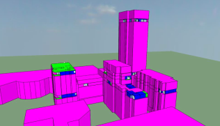

## Analysis Details

This section outlines the details of the overheating analysis

##### Software

IES VE 2018

##### Site Location

Croydon, London

##### Site Image

##### IES Modelling Image

\newpage

## TM59 Results

This section outlines the results from CIBSE TM59 analysis.

The CIBSE TM59 standard outlines a methodology for the assessment of overheating risk in homes. Two criteria are defined within this standard:
* Criterion a: For living rooms, kitchens and bedrooms: the number of hours during which DT is greater than or equal to one degree (K) during the period May to September inclusive shall not be more than 3% of occupied hours.
* Criterion b: For bedrooms only: the operative temperature from 10 pm to 7 am shall not exceed 26C for more than 1% of annual hours (33 hours)

In order to pass TM59, bedrooms have to pass both criteria while living rooms have to pass just Criterion a.

### Benchmark

### As Designed

\newpage

## Individual Model Details

This section outlines the assumptions and design inputs used within the overheating modelling, for both the *Benchmark* and *As Designed* models

### Benchmark

##### Description

Benchmark Description

##### Fabric

The parameters of the building fabric are detailed in the following table:

|                       | Parameter Values   | Notes                     |
|:----------------------|:-------------------|:--------------------------|
| Average Glazing Ratio | 55.1               | (%)                       |
| U-Value: Walls        | 0.1                | (W/m^2.K)                 |
| U-Value: Floor        | 0.1                | (W/m^2.K)                 |
| U-Value: Roof         | 0.1                | (W/m^2.K)                 |
| U-Value: Opaque Doors | 0.1                | (W/m^2.K)                 |
| U-Value: Windows      | 1.0                | (W/m^2.K)                 |
| G-value               | 0.4                |                           |
| Window Frame Factor   | 0.9                |                           |
| Door Frame Factor     | 0.9                |                           |
| Air Permeability      | 3                  | At 50Pa, Units: m^3/h.m^2 |
| Thermal Mass          | Lightweight        |                           |

##### Ventilation Description

Nat Vent

##### Cooling Description

No Cooling

##### Summer (Elevated) Air Speed

0.1 m/s

### As Designed

##### Description

As Designed Description

##### Fabric

The parameters of the building fabric are detailed in the following table:

|                       | Parameter Values   | Notes                     |
|:----------------------|:-------------------|:--------------------------|
| Average Glazing Ratio | 55.1               | (%)                       |
| U-Value: Walls        | 0.1                | (W/m^2.K)                 |
| U-Value: Floor        | 0.1                | (W/m^2.K)                 |
| U-Value: Roof         | 0.1                | (W/m^2.K)                 |
| U-Value: Opaque Doors | 0.1                | (W/m^2.K)                 |
| U-Value: Windows      | 1.0                | (W/m^2.K)                 |
| G-value               | 0.4                |                           |
| Window Frame Factor   | 0.9                |                           |
| Door Frame Factor     | 0.9                |                           |
| Air Permeability      | 3                  | At 50Pa, Units: m^3/h.m^2 |
| Thermal Mass          | Lightweight        |                           |

##### Ventilation Description

Nat Vent

##### Cooling Description

No Cooling

##### Summer (Elevated) Air Speed

0.1 m/s

\newpage

## Indoor Temperature Graphs

This section compares the indoor temperatures for both the *Benchmark* and *As Designed* models, for a typical summer week.

A number of example rooms were used, to show an overview of the indoor temperatures across the building.

\newpage

## Appendix A: Full Model Details

This section outlines all model inputs, for both the *Benchmark* and *As Designed* models

|                                    | Benchmark Value           | As Designed Value         | Notes                                       | Category       |
|:-----------------------------------|:--------------------------|:--------------------------|:--------------------------------------------|:---------------|
| Model Desc                         | Benchmark Description     | As Designed Description   | General Description of the Model            | Misc           |
| Date                               | 2020-01-01                | 2020-01-01                | Date of Model Creation                      | Refs           |
| General Reference                  | TM59 overheating analysis | TM59 overheating analysis |                                             | Refs           |
| London Plan Reference              | CIBSE TM59: 2017          | CIBSE TM59: 2017          | Reference Document Title, for London Plan   | Refs           |
| Average Glazing Ratio              | 55.1                      | 55.1                      | (%)                                         | Fabrics        |
| U-Value: Walls                     | 0.1                       | 0.1                       | (W/m^2.K)                                   | Fabrics        |
| U-Value: Floor                     | 0.1                       | 0.1                       | (W/m^2.K)                                   | Fabrics        |
| U-Value: Roof                      | 0.1                       | 0.1                       | (W/m^2.K)                                   | Fabrics        |
| U-Value: Opaque Doors              | 0.1                       | 0.1                       | (W/m^2.K)                                   | Fabrics        |
| U-Value: Windows                   | 1.0                       | 1.0                       | (W/m^2.K)                                   | Fabrics        |
| G-value                            | 0.4                       | 0.4                       |                                             | Fabrics        |
| Window Frame Factor                | 0.9                       | 0.9                       |                                             | Fabrics        |
| Door Frame Factor                  | 0.9                       | 0.9                       |                                             | Fabrics        |
| Air Permeability                   | 3                         | 3                         | At 50Pa, Units: m^3/h.m^2                   | Fabrics        |
| Thermal Mass                       | Lightweight               | Lightweight               |                                             | Fabrics        |
| Vent Desc                          | Nat Vent                  | Nat Vent                  | General Description of Ventilation Strategy | Ventilation    |
| Openable Area: Bedrooms            | All Windows               | All Windows               |                                             | Ventilation    |
| Opening Profile: Bedrooms          |                           |                           | (Living Room & Kitchen Spaces)              | Ventilation    |
| Openable Area: Other               | All Windows               | All Windows               | (Living Room & Kitchen Spaces)              | Ventilation    |
| Background Mechanical?             | True                      | True                      |                                             | Ventilation    |
| MVHR system heat recovery?         | True                      | True                      |                                             | Ventilation    |
| Gains Desc                         | As per TM59               | As per TM59               | General Description of Internal Gains       | Internal Gains |
| Gains: Technical Params            | N/A                       | N/A                       |                                             | Internal Gains |
| Cooling Desc                       | No Cooling                | No Cooling                | General Description of Cooling Strategy     | Cooling        |
| Cooling: Technical Characteristics | N/A                       | N/A                       |                                             | Cooling        |
| Adjacent buildings included?       | False                     | False                     |                                             | Context        |
| Trees included?                    | False                     | False                     |                                             | Context        |
| Air Speed                          | 0.1                       | 0.1                       | Summer (Elevated) Speed, Units: m/s         | Context        |

